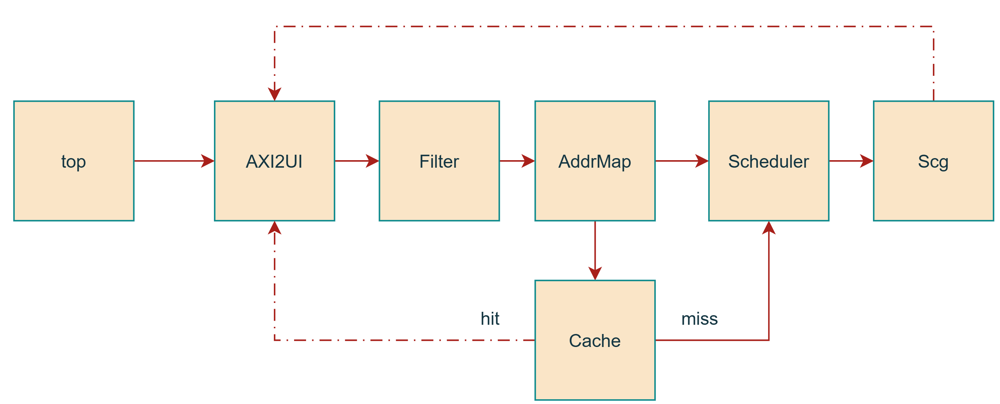

# 概述

MCsim针对内存控制器建模，整体上与YuQuan IP的微结构保持一致，但不带数据，只模拟性能，主要作用是探索某些微架构设计对内存控制器的性能影响。

## 目录结构

```
.
├── docs/           # 文档目录
├── include/        # 头文件目录
│   ├── config.h    # 配置文件，所有模块共用
│   └── ...
├── Makefile        # Makefile
├── mc_trace/       # trace目录
├── scripts/        # 一些实用脚本
└── src/            # 各模块源码目录
    ├── main.cc     # 程序入口
    └── ...
```

## 数据流向



和YuQuan IP有所不同的是，MCsim在模拟数据返回时，简化了数据通路，直接由各个模块，经过固定延迟（可调参），返回给AXI2UI。

## 各模块功能的简要说明

1. **`top`**：处理trace、下发AXI命令到AXI2UI。
2. **`AXI2UI`**：将AXI命令拆分组合成UI（User Interface）命令，并打上token（用于rob重排序），下发给Filter。目前只支持突发长度为2的AXI请求。
3. **`Filter`**：根据Filter策略，给命令设置标记位，决定将何种命令发给Cache、何种命令直接发给Scheduler。
4. **`AddrMap`**：根据不同的bg/bank/row/col地址映射，将AXI地址解析成SDRAM地址。
5. **`Cache`**：实现系统级缓存，提升读写性能。
6. **`Scheduler`**：实现读写调度、行调度策略，充分利用内存颗粒的开关行特性，减少访存请求的执行时间。
7. **`Scg`**（SDRAM Command Generator）：实现DFI接口各bank间命令的调度和时序检查，保证内存读写的正确性。

## 各模块通用的关键函数

- **`addTrans()`**：由上游调用，将信号传递到本模块。
- **`step()`**：每个cycle调用一次，模拟一个时钟周期内，本模块的信号变化。从下游到上游依次调用`step()`，可以模拟硬件的流水线效果。
- **`all_done()`**：返回true时，代表本模块没有待处理的请求。

## LICENSE

Copyright © 2020-2026 Institute of Computing Technology, Chinese Academy of Sciences.

Copyright © 2021-2026 Beijing Institute of Open Source Chip

MCSim is licensed under [Mulan PSL v2](LICENSE).